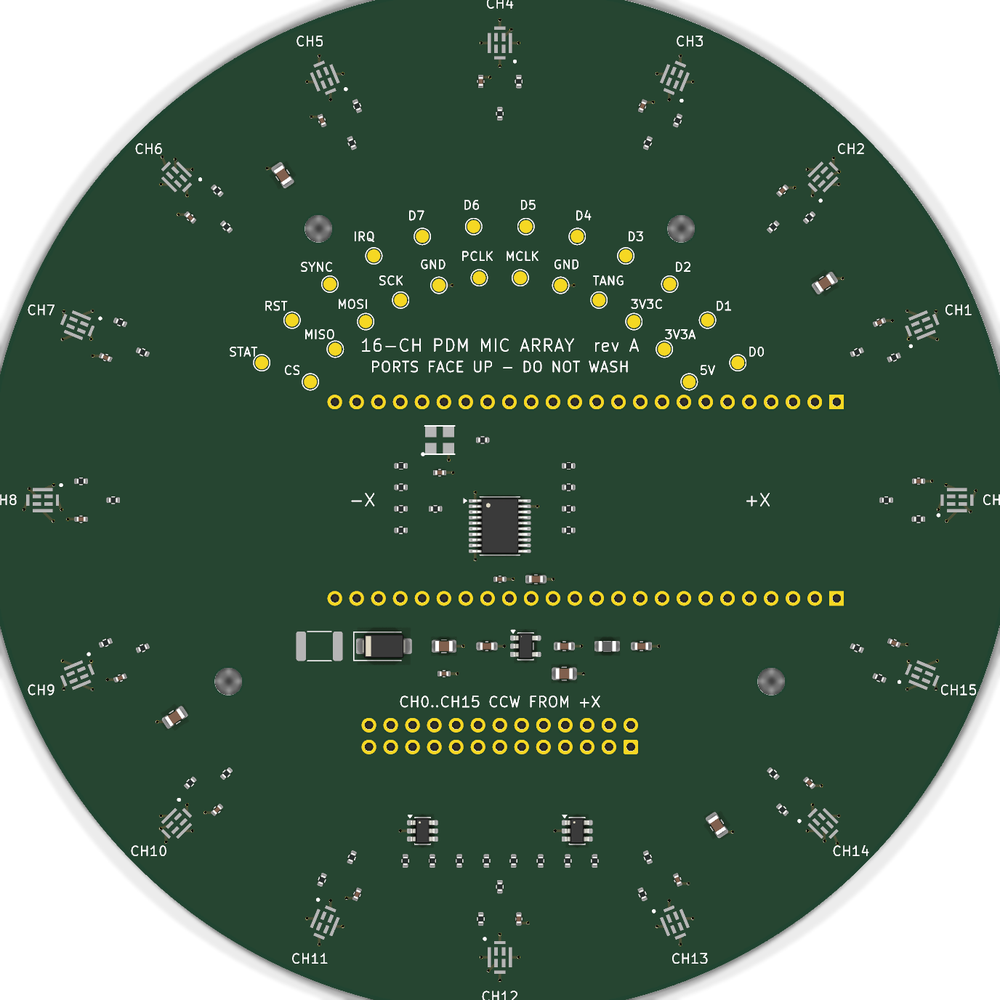

# 16-channel circular PDM microphone array

A 120 mm circular, four-layer KiCad 10 carrier for sixteen `MSM261DHP006` PDM
MEMS microphones running at 3.3 V. A socketed Sipeed Tang Nano 9K performs
acquisition and decimation; a 2012 Raspberry Pi Model B collects the audio over
SPI0 through a 26-way ribbon.

The sixteen acoustic ports sit on a 54.00 mm radius at 22.5 degree intervals,
channel 0 on +X, numbered counter-clockwise viewed from the component side.

## Design summary

| | |
|---|---|
| Board | 120 mm circle, 1.6 mm, 4 layers, ENIG, green / white |
| Stackup | signal / GND / GND / signal - both inner layers solid ground |
| Microphones | 16 x `MSM261DHP006`, top-ported, 3.3 V, ports up at the rim |
| Channel pairing | adjacent channels share a data line by clock edge, 8 data nets |
| Reference clock | 24.576 MHz oscillator to a global-clock FPGA pin |
| PDM clock | 3.072 MHz, buffered to 8 series-terminated branches |
| Sample rate | 48 kHz after decimate-by-64 |
| Level translation | none - microphones, FPGA banks and Pi GPIO are all 3.3 V |
| Power | Raspberry Pi 5 V only, via PTC and series Schottky |
| Microphone supply | `LP5907MFX-3.3`, 10 uVrms, 82 dB PSRR at 1 kHz |
| Host link | SPI0, 25 MHz design target, ESD-protected and series-damped |
| Assembly | all SMT on top; module sockets and IDC header hand-soldered |

The `MSM261DHP006` is a top-ported part, so "outward-facing" is realised as
ports facing up at the rim rather than radially. The capsules are
omnidirectional, so the array response is set by the port geometry, not by
package orientation; the alternative - sixteen perpendicular daughter-cards -
cannot be assembled by JLCPCB. This is discussed in
[docs/architecture.md](docs/architecture.md).

## Documentation

- [docs/architecture.md](docs/architecture.md) - signal, clock, power and
  stackup decisions, Tang Nano 9K pin assignments, and known limitations.
- [docs/host-interface.md](docs/host-interface.md) - Raspberry Pi pinout,
  bandwidth analysis and the wire protocol.
- [docs/routing.md](docs/routing.md) - what is pre-routed and why, the
  microphone escape geometry, and the FreeRouting invocation including three
  version-specific workarounds that fail silently if omitted.
- [docs/manufacturing.md](docs/manufacturing.md) - order options, order remark,
  microphone handling limits and bring-up sequence.
- [docs/sources.md](docs/sources.md) - every datasheet and manufacturer rule the
  design relies on, with the facts taken from each.

## Repository layout

| Path | Contents |
|---|---|
| `microphone_array_v2.kicad_sch` | generated schematic - do not hand-edit |
| `microphone_array_v2.kicad_pcb` | generated board - do not hand-edit |
| `microphone_array_v2.kicad_pro` | project settings, net classes, design rules |
| `MicArrayV2.kicad_sym` | generated project symbols |
| `MicArrayV2.pretty/` | project footprints: microphone and oscillator |
| `constraints.json` | frozen requirements and manufacturing profile |
| `tools/` | design source of truth, generators and checkers |
| `docs/` | engineering documentation |
| `generated/` | reports, renders and release artefacts |

## Source of truth

`tools/netlist.py` holds the complete component list, netlist and placement.
The schematic and the board are both generated from it, so they cannot drift
apart. Three independent gates protect that:

- `tools/check_netlist_parity.py` extracts the netlist from the generated
  schematic with `kicad-cli` and compares it against `netlist.py`, including an
  exact match on which pins are deliberately left unconnected.
- KiCad's `--schematic-parity` DRC compares the board against the schematic.
- `tools/check_placement.py` re-derives the array geometry from the board:
  every microphone's acoustic port radius and azimuth, every Tang Nano 9K
  socket pin coordinate, courtyard overlaps by exact polygon distance, JLCPCB
  package-pair body spacing, and edge clearance.

`tools/check_routes.py` adds the post-route constraints KiCad cannot express:
allowed layers per net, via budgets on the clock nets, branch length matching
across the eight microphone pairs, and the no-sharper-than-45-degree policy.

Regeneration commands are in [docs/manufacturing.md](docs/manufacturing.md).

## Status

**Not ready to order — routing is unfinished.** The schematic, component
selection, placement, stackup, rules and tooling are complete and pass their
gates; the autorouted candidate is rejected by the post-route gate. Nine
connections are still open, and the clock nets do not meet their layer, via and
length-matching constraints.

[docs/status.md](docs/status.md) lists exactly what fails and what to do next.
No release has been sealed.
